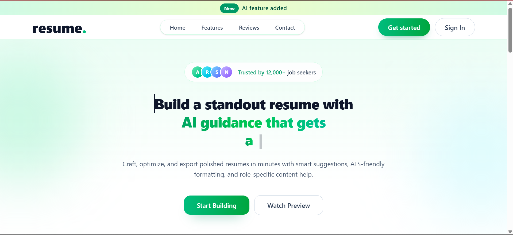

# 🚀 AI Resume Builder

An AI-powered Resume Builder that generates professional and optimized resumes instantly using modern web technologies.

---

## 🌐 Live Demo
🔗 https://ai-resume-builder-wine-seven.vercel.app/

---

## 📸 Screenshots




## ✨ Features

- 🤖 AI Generated Professional Summary
- ⚡ Fast & Optimized (Code Splitting + Lazy Loading)
- 📱 Fully Responsive Design
- 📄 Download Resume as PDF
- 🧠 Smart Form Handling
- 🔐 Secure Environment Variable Setup

---

## 🛠 Tech Stack

- React.js
- Vite
- Tailwind CSS
- OpenAI API
- JavaScript (ES6+)

---

## 🏗 How It Works

1. User enters personal & professional details
2. AI generates optimized summary
3. Resume preview updates in real-time
4. User downloads resume as PDF

---

## ⚙️ Installation

```bash
git clone https://github.com/chiragdhiman99/ai-resume-builder.git
cd ai-resume-builder
npm install
npm run dev
